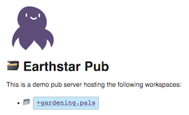
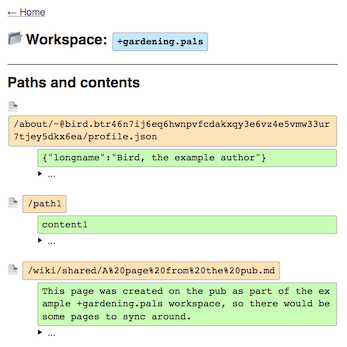

# Earthstar Pub

Hosts and syncs [Earthstar](https://github.com/cinnamon-bun/earthstar) workspaces over HTTP.  One pub server can hold multiple Earthstar workspaces.

You can
* View the data through a web interface
* Sync your local files to/from the server using [earthstar-cli](https://github.com/cinnamon-bun/earthstar-cli/)

Pub servers don't sync directly to each other (yet?).

## Caveats

This is for demonstration purposes, so it shows all the workspaces and data over the web.  Normally Earthstar pubs should not reveal which workspaces they hold.

It stores data in memory, not on disk, so it will forget everything if restarted.  Note that glitch.com restarts projects often.

There's an [issue](https://github.com/earthstar-project/earthstar-pub/issues/1) describing how to store data in SQLite for persistence.

## Demo

https://earthstar-demo-pub-v5-a.glitch.me/





## Running on Glitch

Make your own copy on Glitch by going [here](https://glitch.com/~earthstar-demo-pub-v5-a) and clicking "Remix this".

Or start a new Glitch project from scratch:

* Make a new Express project
* Go to Glitch's `package.json`, click "Add package", and add `earthstar-pub`
* Delete the demo code from `server.js`
* Copy-paste the code from this repo's [`example.js`](https://github.com/earthstar-project/earthstar-pub/blob/master/example.js) into Glitch's `server.js`
* Rename your project, at the top left
* Click "🕶 Show > In a New Window" to visit your pub

## Easy command-line install

Install
```
npm install --global earthstar-pub
```

Run
```
earthstar-pub
```

Then visit http://localhost:3333.

Options:
```
Usage: earthstar-pub [options]

Run an HTTP server which hosts and replicates Earthstar workspaces.

Options:
  -p, --port <port>   Which port to serve on
                        (default: "3333")

  --readonly          Don't accept any pushed data from users
                        (default: false)

  -c, --closed        Accept data to existing workspaces but
                        don't create new workspaces.
                        (default: false)

  -d, --discoverable  Allow workspace addresses to be discovered
                        via the web interface.  Only use
                        this for testing purposes.
                        (default: false)

  -s, --sqlite        Use sqlite instead of memory.  Default is memory.
                        (default: false)

  --dataFolder <folder>
                      Folder in which to store sqlite files.
                        Defaults to current directory.
                        Only used for sqlite, not memory.
                        (default: ".")
                      
  --logLevel <logLevel>
                      Show this many logs. 0 = none, 1 = basic, 2 = verbose,
                        3 = include sensitive information (workspace addresses).
                        (default: "0")
```

## Developing

Clone and install
```
git clone https://github.com/earthstar-project/earthstar-pub
cd earthstar-pub
npm install
```

Compile typescript
```
npm run build
```

Start the server
```
npm start
```

Then visit http://localhost:3333.
